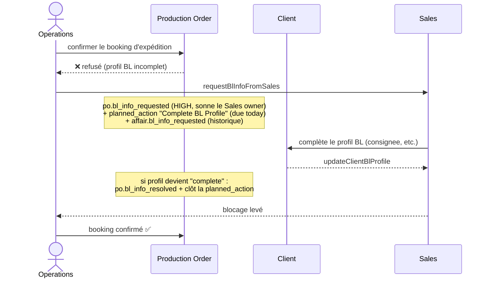

# Workflow — Demande d'info BL (Operations ↔ Sales)

> Quand l'expédition est bloquée faute d'un profil Bill of Lading (BL) complet, les Opérations sollicitent le commercial — un mini-workflow de déblocage.

## 1. Diagramme Mermaid

## 2. Tableau

| Étape | Rôle | Action | Garde / condition | Événement |
|---|---|---|---|---|
| Tentative de booking | Operations | `updateProductionOrderShipment` | **refusé si profil BL incomplet** | — |
| Demander l'info | Operations | `requestBlInfoFromSales` | `production_order.edit_shipment` ; anti-duplicate (1 pending) | `po.bl_info_requested` (high) + `affair.bl_info_requested` |
| (effet) | (système) | crée `planned_action` | titre « Complete Shipping / BL Profile », due today | — |
| Compléter le BL | Sales | `updateClientBlProfile` | — | `client.updated` |
| (résolution) | (système) | si profil `complete` | émet résolution + clôt la planned_action | `po.bl_info_resolved` |
| Booking confirmé | Operations | `updateProductionOrderShipment` | profil désormais complet | `po.shipment_updated` |

## 3. Explication en français clair

Pour expédier, les **Opérations** doivent confirmer la réservation de transport (*booking*). L'application **refuse** cette confirmation tant que le **profil BL du client** (expéditeur, destinataire, notify, documents) n'est pas **complet** — la complétude est **calculée**, jamais stockée.

Quand le profil est incomplet, les Opérations **sollicitent le commercial** via « Request information from Sales ». Cela :
- émet un événement de **forte priorité** qui **fait sonner la cloche du commercial propriétaire** (le booking est bloqué tant qu'il n'agit pas),
- crée une **action planifiée** sur l'affaire (« Compléter le profil BL », due aujourd'hui),
- inscrit une trace dans l'historique de l'affaire.
Un garde **anti-doublon** empêche d'envoyer plusieurs demandes tant qu'une est en attente.

Le **commercial** complète alors le profil BL du client. Dès que le profil devient **complet**, l'application émet automatiquement la **résolution** (le blocage est levé, sans faire sonner personne — une bonne nouvelle n'a pas besoin d'alarme) et **clôt l'action planifiée**. Les Opérations peuvent enfin confirmer le booking.

## Changement de propriétaire
- **Aucun**. Le workflow relie l'ordre (côté Operations) au client/affaire (côté Sales) sans transférer de propriété.
</content>
