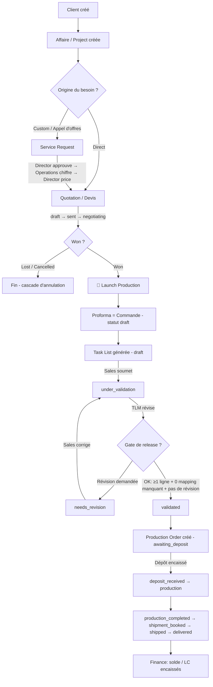

# Workflow — Pipeline de bout en bout

> Le parcours complet d'une opportunité, du client à l'encaissement. C'est la colonne vertébrale validée de l'application (**[V]** : testé end-to-end sous vrais comptes).

## 1. Diagramme Mermaid

## 2. Tableau des étapes

| # | Étape | Rôle | Action serveur | Événement | Objet créé |
|---|---|---|---|---|---|
| 1 | Créer le client | Sales | `createClientAction` | `client.created` | Client |
| 2 | Créer l'affaire | Sales | `createAffair` / `quickCreateAffair` | — | Affaire |
| 3a | (Optionnel) Service Request | Sales → Director → Ops → Director | voir [service-request-lifecycle.md](service-request-lifecycle.md) | `pr.*` | Service Request → Devis |
| 3b | Créer le devis | Sales | `saveDocument` | `doc.created` | Quotation |
| 4 | Envoyer / négocier | Sales | `updateDocumentStatus` | `doc.status_changed` | — |
| 5 | Marquer gagné | Sales | `updateDocumentStatus` (won) | `doc.won` | — |
| 6 | Launch Production | Sales | `launchProduction` | `doc.created` (proforma) | Proforma + Task List |
| 7 | Soumettre la task list | Sales | `submitForValidation` | `tl.submitted_for_validation` | — |
| 8 | Valider (release) | TLM/Ops | `validateTaskList` (gate `evaluateRelease`) | `tl.validated` | Production Order |
| 9 | Encaisser le dépôt | Operations | `updateProductionOrderPayments` | `po.deposit_received` | — |
| 10 | Suivre la production | Operations | `updateProductionOrderStatus`/deadline/delay | `po.status_changed`, … | — |
| 11 | Expédier | Operations | `updateProductionOrderShipment` (gate BL) | `po.shipment_updated` | CI / docs |
| 12 | Encaisser le solde | Operations | `updateProductionOrderPayments` | `po.balance_received` | — |
| — | Suivi finance | Finance | (lecture seule `/finance`) | — | — |

## 3. Explication en français clair

Le parcours commence par la création d'un **client** (avec son code 3 lettres) puis d'une **affaire** — le conteneur du deal, **obligatoire** pour tout devis. Selon l'origine, le commercial passe soit par une **Service Request** (cas custom/appel d'offres, qui fait intervenir le Directeur et les Opérations pour chiffrer avant de produire un devis), soit directement par un **devis**.

Le **devis** est négocié (`draft → sent → negotiating`) puis **gagné**. À ce moment, le commercial clique **« Launch Production »** : l'application crée en arrière-plan la **proforma** (la commande, volontairement en statut *draft* pour ne pas compter deux fois le chiffre d'affaires) et la **task list** (la feuille d'atelier), puis l'ouvre.

Le commercial **soumet** la task list ; l'équipe **production** (TLM / Operations) la **valide**, à condition que le **gate de release** soit satisfait (au moins une ligne produit, aucun mapping usine manquant, aucune révision en attente). Si ce n'est pas le cas, elle est **renvoyée en révision** au commercial. À la validation, un **ordre de production** est créé automatiquement (statut *awaiting_deposit*).

Les **Opérations** encaissent alors le **dépôt** (ce qui lance la production et gèle la baseline de délai), suivent la **production** et les **délais**, **expédient** (sous réserve d'un profil BL complet, avec la Commercial Invoice et les documents de transport), puis encaissent le **solde**. La **Finance** suit l'ensemble des balances en lecture seule.

À tout moment, annuler le devis déclenche une **cascade d'annulation** (trigger base de données) qui annule la task list et l'ordre liés. Chaque transition est tracée dans le journal d'**événements**, qui alimente les notifications et les tableaux de bord.

## Changements de propriétaire
- **Aucun** sur le chemin nominal. La proforma, la task list et l'ordre **héritent** du propriétaire du devis (`sales_owner_id` → `affair_id`).
- Réassignation manuelle possible (client/affaire/document) réservée à `canSupervise` (Sales Director / Admin).
</content>
