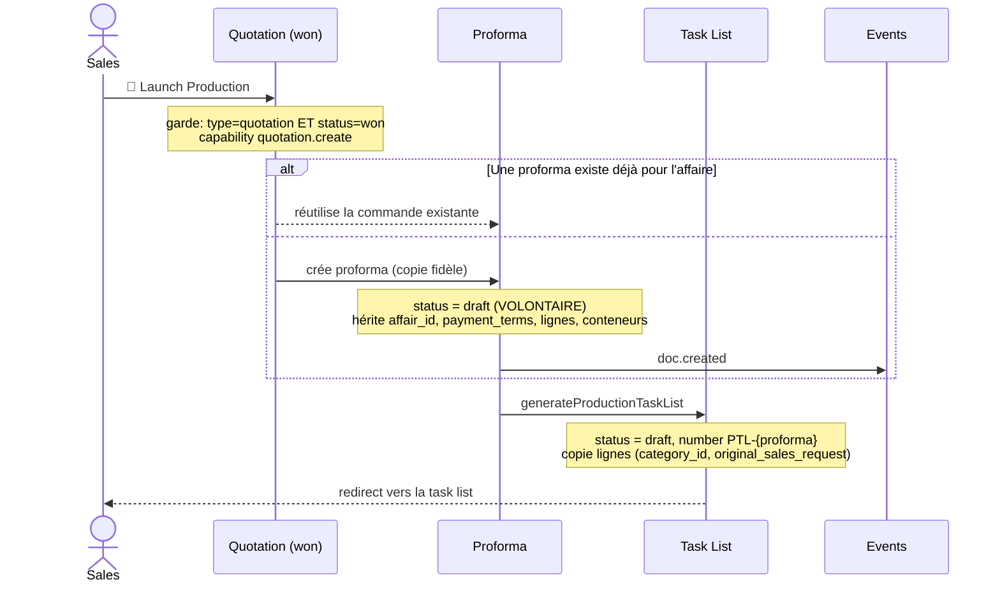

# Workflow — Launch Production (Devis gagné → Proforma + Task List)

> Le « one-click WON → production » : transformer un devis gagné en commande prête à produire.

## 1. Diagramme Mermaid

## 2. Tableau

| Étape | Rôle | Action | Garde / condition | Résultat | Événement |
|---|---|---|---|---|---|
| Déclenchement | Sales | `launchProduction` | `quotation.create` ; source `type=quotation` ET `status=won` | — | — |
| Commande existante ? | — | — | 1 commande par affaire | réutilise la proforma | — |
| Créer la proforma | (système) | copie fidèle du devis | `status='draft'` volontaire | Proforma | `doc.created` |
| Générer la task list | (système) | `generateProductionTaskList` | source = **proforma** uniquement | Task List `draft` | — |
| Redirection | — | — | — | ouvre `/task-lists/[id]` | — |

## 3. Explication en français clair

Quand un devis est **gagné**, le commercial clique sur **« Launch Production »**. L'application vérifie que c'est bien un **devis** (pas une proforma) et qu'il est **gagné**, puis :

1. Elle crée la **proforma** — une **copie fidèle** du devis (client, affaire, lignes, conteneurs, conditions de paiement, ports, banque…). Cette proforma est la **commande** qui pilotera la production. Elle est créée en statut **brouillon** *exprès* : ainsi elle ne sera **jamais** comptée comme un second chiffre d'affaires (le CA reste le devis gagné). S'il existe déjà une commande pour cette affaire, l'application la **réutilise** (une seule commande par affaire).

2. Depuis cette proforma, elle génère immédiatement la **task list** (feuille d'atelier), en copiant les lignes produit (avec leur catégorie et le besoin client d'origine). La task list hérite de l'affaire (`affair_id`).

3. Elle redirige le commercial vers la task list, prête à être soumise pour validation.

Le commercial ne manipule **jamais** les mécaniques de la proforma : tout est automatique.

## Changement de propriétaire
- **Aucun** : proforma et task list **héritent** du propriétaire du devis.

## Règles clés mobilisées
- Proforma toujours `draft` (anti-double-comptage CA) ; jamais `won`.
- Task list créée **depuis la proforma**, jamais directement depuis le devis.
- Héritage `affair_id` (fix F4) sur proforma, task list et futur ordre.
</content>
