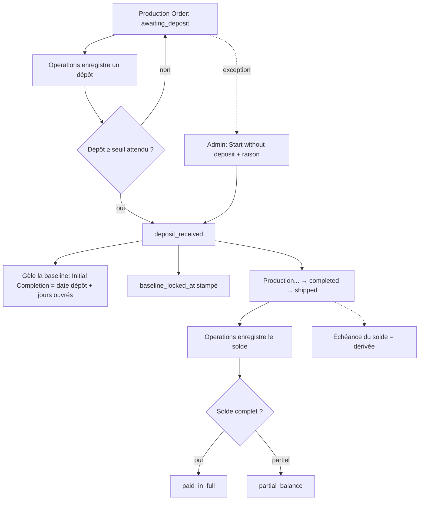

# Workflow — Flux Dépôt → Production → Solde

> Comment l'argent fait avancer la production, et comment l'échéance du solde est calculée.

## 1. Diagramme Mermaid

## 2. Tableau

| Étape | Rôle | Action | Effet | Événement |
|---|---|---|---|---|
| Seuil de dépôt | (calcul) | `computeExpectedDeposit` | `total × deposit_percent/100` (0 en LC) | — |
| Enregistrer le dépôt | Operations | `updateProductionOrderPayments` | si ≥ seuil → `deposit_received` + baseline gelée | `po.deposit_received` |
| Override | Admin | `startWithoutDeposit` | raison obligatoire, active la production | `po.deposit_override` |
| Enregistrer le solde | Operations | `updateProductionOrderPayments` | état `partial_balance` / `paid_in_full` (pas d'auto-advance) | `po.balance_received` |
| Échéance du solde | (calcul) | `computeEffectiveBalanceDueDate` | dérivée (voir ci-dessous) | — |

## 3. Calcul de l'échéance du solde (`computeEffectiveBalanceDueDate`)

| Priorité | Condition | Échéance |
|---|---|---|
| 1 | `balance_due_date` saisi manuellement | la date saisie |
| 2 | `deposit_balance` + `before_shipment` | la **deadline de production** courante |
| 3 | `lc`/`hybrid` + jours usance + ETA connue | **ETA + lc_days** |
| 4 | sinon, ETA connue | **ETA** |
| 5 | aucun ancrage | **null** (pas d'échéance, pas d'alerte) |

## 4. Explication en français clair

Le paiement pilote la production. Tant que le **dépôt** n'est pas reçu, la commande reste **« en attente de dépôt »**. Le seuil attendu est calculé à partir des **conditions de paiement** du devis (un pourcentage du total ; nul en Lettre de Crédit). Dès qu'un dépôt **atteint ou dépasse** ce seuil, la commande passe en **« dépôt reçu »** et la **baseline de délai est gelée** : la date d'achèvement initiale devient « date du dépôt + jours ouvrés engagés », et ne bougera plus.

Un **administrateur** peut, par exception, **lancer la production sans dépôt** (client de confiance), mais l'action exige une **raison** et est tracée (un badge « sans dépôt » apparaît partout, et une alerte se déclenche si le paiement reste manquant au-delà de 14 jours).

L'**échéance du solde** n'est presque jamais saisie à la main : elle est **dérivée** de la logique de paiement et **suit automatiquement** les changements de deadline ou d'ETA — sauf si quelqu'un la fige manuellement. Le **solde** lui-même n'a aucun effet automatique sur le statut : c'est la production qui pilote l'expédition et la livraison.

La **Finance** lit tout cela en lecture seule, avec des alertes priorisées (en retard, override impayé, LC qui expire, etc.).

## Changement de propriétaire
- **Aucun**.
</content>
