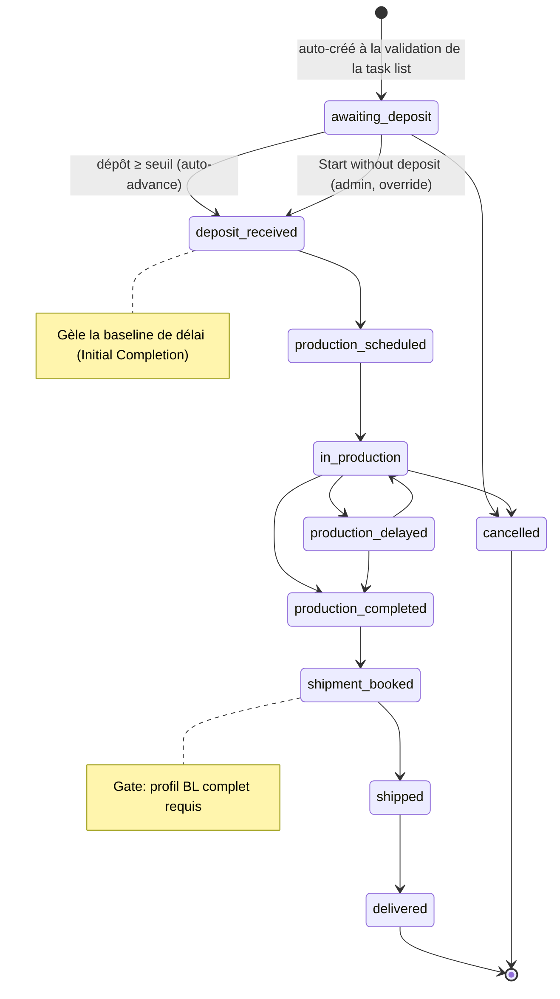

# Workflow — Cycle de vie du Production Order

> Le suivi opérationnel d'une commande validée : du dépôt à la livraison.

## 1. Diagramme Mermaid

> Le CHECK base de données autorise **tout saut** ; les actions permettent skip/cancel. Atteindre un statut « complété » (production_completed → delivered) stampe `actual_completion_date` **une fois**.

## 2. Tableau des transitions

| Transition | Rôle | Action | Capability | Conditions | Événement |
|---|---|---|---|---|---|
| (création) → awaiting_deposit | (système) | `ensureProductionOrderForTaskList` | — | task list validée | `po.created` |
| awaiting_deposit → deposit_received | Operations | `updateProductionOrderPayments` | `production_order.edit_payments` | dépôt ≥ seuil (auto) ; gèle la baseline | `po.deposit_received` |
| awaiting_deposit → (production) | Admin | `startWithoutDeposit` | `production_order.start_without_deposit` | **raison obligatoire** ; idempotent | `po.deposit_override` |
| changement de statut | Operations | `updateProductionOrderStatus` | `production_order.edit_status` | atteindre complété → stampe la date | `po.status_changed` |
| ajuster le délai | Operations | `updateProductionOrderDeadline` | `production_order.edit_deadline` | non-initial → catégorie de délai requise | `po.deadline_changed` |
| définir la timeline | Operations | `setProductionTimeline` | `production_order.set_timeline` | refusé si baseline verrouillée | `po.timeline_set` |
| expédier | Operations | `updateProductionOrderShipment` | `production_order.edit_shipment` | **gate BL : profil complet** | `po.shipment_updated` |
| marquer terminé | Operations | `markProductionComplete` | `production_order.edit_status` | démarré, pas cancelled/déjà fait | `po.production_completed` |
| encaisser le solde | Operations | `updateProductionOrderPayments` | `production_order.edit_payments` | pas d'auto-advance | `po.balance_received` |
| annuler | Operations/Admin | (cascade ou delete) | `production_order.delete` (super) | — | `po.cancelled` |

## 3. Explication en français clair

L'ordre de production est **créé automatiquement** quand la task list est validée, en statut **« en attente de dépôt »** (*awaiting_deposit*).

Les **Opérations** enregistrent alors le **dépôt** : dès qu'il atteint le seuil attendu (calculé depuis les conditions de paiement du devis), l'ordre passe en **« dépôt reçu »** et la **baseline de délai est gelée** (la date d'achèvement initiale = date du dépôt + jours ouvrés engagés). Un **admin** peut exceptionnellement **lancer la production sans dépôt** (« Start without deposit »), à condition de fournir une **raison** (action auditée).

La production avance ensuite par statuts (planifiée → en cours → éventuellement retardée → terminée). Les **délais** sont suivis via des *delay events* catégorisés ; seul un retard de catégorie « production » compte comme une faute usine pour les indicateurs. La **date d'achèvement initiale est immuable** ; seule la date *courante* bouge.

Vient l'**expédition** : confirmer la réservation (*booking*) exige un **profil BL complet** (sinon Operations demande l'information au commercial — voir [bl-info-request-flow.md](bl-info-request-flow.md)). La **Commercial Invoice** et les documents de transport sont générés. La commande passe par *booked → shipped → delivered*.

Enfin, le **solde** est encaissé (sans effet automatique sur le statut — c'est la production qui pilote l'expédition/livraison). La **Finance** suit toutes les balances en lecture seule.

## Changement de propriétaire
- **Aucun** : l'ordre hérite et conserve l'affaire/propriétaire d'origine.

## Règles clés mobilisées
- Auto-advance dépôt ; baseline gelée à l'activation ; `initial_production_deadline` immutable.
- Override = admin + raison ; gate booking = profil BL complet.
- Production complete status-led ; échéance de solde dérivée (suit deadline/ETA).
</content>
