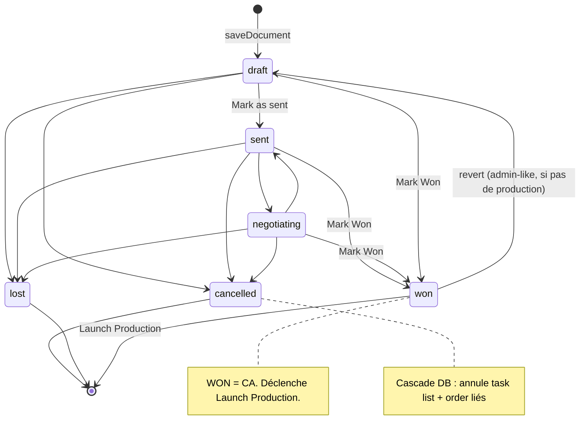
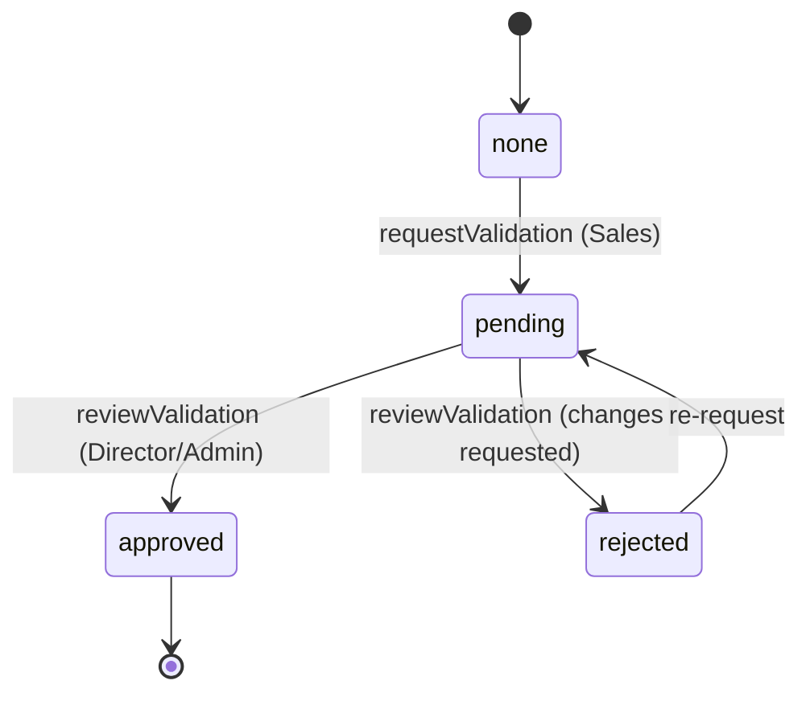

# Workflow — Cycle de vie du Devis (Quotation)

## 1. Diagramme Mermaid

**Boucle de validation advisory (m068, parallèle — ne bloque jamais) :**

## 2. Tableau des transitions

| De → Vers | Rôle | Déclencheur | Capability | Validations / conditions | Événement |
|---|---|---|---|---|---|
| (création) → draft | Sales | `saveDocument` | `quotation.create` | **affaire obligatoire** ; payment_terms valides ; client_code requis | `doc.created` |
| draft → sent | Sales | « Mark as sent » | — (RLS) | — | `doc.status_changed` |
| sent ↔ negotiating | Sales | switcher | — | — | `doc.status_changed` |
| → won | Sales | « Mark Won » | — | **proforma interdite** | `doc.won` |
| → lost | Sales | DocStatusActions | — | cascade DB | `doc.lost` |
| → cancelled | Sales | DocStatusActions | `quotation.cancel` | cascade DB (task lists + orders) | `doc.cancelled` |
| won → éditable (revert) | Admin-like | — | — | **bloqué si production existe** ; sinon admin-like only (H1) | `doc.status_changed` |
| cancelled/lost → actif (reopen) | — | — | — | **bloqué si enfants annulés** (H2) → « créer une version » | — |
| Réassigner owner | Director/Admin | OwnerAssignSelect | `canSupervise` | change `sales_owner_id` (→ TL/PO) | — |
| Archiver / Désarchiver | Admin | menu ⋯ | `quotation.archive` | soft-delete | `doc.status_changed` |
| Supprimer | Admin/Super | menu ⋯ | `quotation.delete` | **verrouillé si task list/PO** (m078) | `doc.deleted` |
| Demander validation | Sales | « Request validation » | — | advisory | `doc.validation_requested` |
| Approuver / Refuser | Director/Admin | ValidationPanel | `canSupervise` | advisory (ne bloque pas) | `doc.validation_approved/rejected` |

## 3. Explication en français clair

Un devis naît en **brouillon** (`draft`), modifiable librement par son commercial. Il doit obligatoirement être rattaché à une **affaire** et ses conditions de paiement doivent être valides. Une fois **envoyé** (`sent`), il n'est **plus jamais modifié en place** : toute évolution crée une **nouvelle version** (V2, V3…) dans la même affaire — l'original reste intact pour l'historique.

Le devis peut être **négocié**, puis **gagné** (`won`) — c'est le seul statut qui compte comme **chiffre d'affaires**. Une **proforma ne peut jamais être marquée gagnée** (ce serait un double comptage). À l'inverse, **perdu** ou **annulé** sont des fins de course ; l'annulation déclenche une **cascade** au niveau base de données qui annule automatiquement la task list et l'ordre de production liés.

Des garde-fous protègent l'intégrité : un devis **gagné** ne peut **pas** redevenir éditable s'il a déjà une production (sinon réservé aux admins) ; un devis annulé/perdu ne se « rouvre » pas (on crée une version) ; et un devis avec task list/ordre **ne peut pas être supprimé** (Decision F).

En parallèle, une **boucle de validation facultative** (advisory) permet à un commercial de demander l'avis d'un **Directeur commercial** avant d'envoyer : elle informe mais **ne bloque jamais** l'envoi ni le gain.

## Changement de propriétaire
- Seule la **réassignation explicite** (`canSupervise`) change `sales_owner_id` ; elle se propage à la task list et à l'ordre via l'affaire. Les transitions de statut n'en provoquent aucun.
</content>
