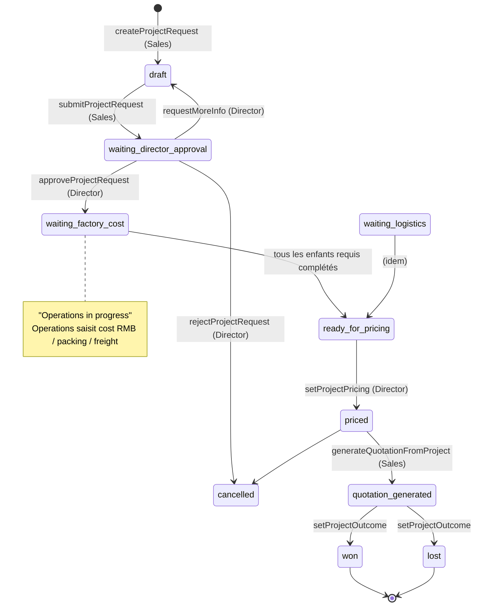
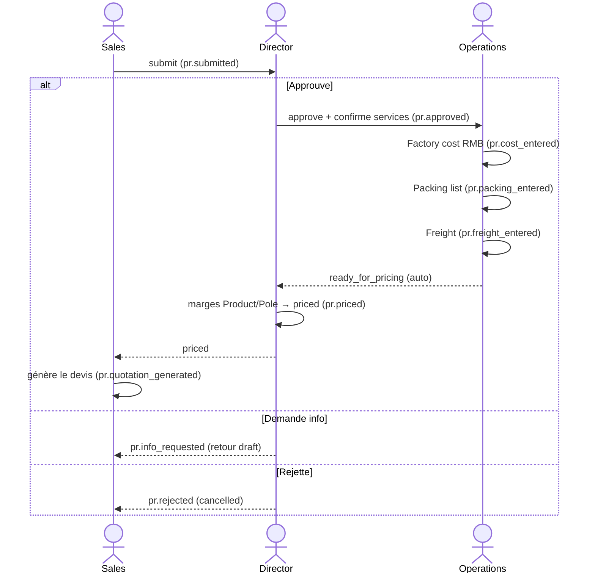

# Workflow — Cycle de vie du Service Request

> Le workflow multi-rôles **Sales → Director → Operations → Director → Sales** qui transforme un besoin custom/appel d'offres en devis.
> ⚠️ **Approbation Director non testée end-to-end** (prototype partiel — HANDOVER).

## 1. Diagramme Mermaid (statuts)

## 2. Diagramme Mermaid (séquence multi-rôles)

## 3. Tableau des transitions

| De → Vers | Rôle | Action | Capability | Validations | Événement |
|---|---|---|---|---|---|
| (création) → draft | Sales | `createProjectRequest` | `project.create` | client (sauf tender) + affaire + qty si packing/freight | `pr.created` |
| draft → waiting_director_approval | Sales | `submitProjectRequest` | `project.create` | — | `pr.submitted` |
| → draft (renvoi) | Director | `requestMoreInfo` | `project.approve` | — | `pr.info_requested` |
| → cancelled | Director | `rejectProjectRequest` | `project.approve` | — | `pr.rejected` |
| → waiting_factory_cost | Director | `approveProjectRequest` | `project.approve` | crée les enfants requis | `pr.approved` |
| (saisie) Factory cost | Operations | `enterFactoryCost` | `project.enter_cost` | coût RMB **caché aux Sales** | `pr.cost_entered` |
| (saisie) Packing | Operations | `enterPacking` | `project.enter_logistics` | conteneurs | `pr.packing_entered` |
| (saisie) Freight | Operations | `enterFreight` | `project.enter_logistics` | dérivé du packing | `pr.freight_entered` |
| → ready_for_pricing | (système) | `recomputeWaitingStatus` | — | tous les enfants requis `completed` | `pr.ready_for_pricing` |
| → priced | Director | `setProjectPricing` | `project.set_pricing` | marge produit requise ; client requis | `pr.priced` |
| → quotation_generated | Sales | `generateQuotationFromProject` | `project.generate_quotation` | ≥1 section ; appelle `saveDocument` | `pr.quotation_generated` |
| → won/lost | Director/Sales | `setProjectOutcome` | `project.set_pricing` | — | `pr.won/lost` |
| (override coût) | Director | `overrideFactoryCost` | `project.override_cost` | **raison obligatoire** + audit | `pr.cost_overridden` |

## 4. Explication en français clair

Quand le coût d'une opportunité n'est pas connu (produit custom, appel d'offres), le commercial crée une **Service Request** : un formulaire structuré décrivant le besoin et les **services demandés** (chiffrage produit, liste de colisage, fret). La demande est obligatoirement rattachée à une **affaire**.

Le commercial la **soumet**. Le **Directeur commercial** l'examine : il peut **demander des informations** (retour au commercial), **rejeter**, ou **approuver** en confirmant quels chiffrages doivent être faits.

Une fois approuvée, ce sont les **Opérations** qui saisissent les coûts : le **coût usine en RMB** (qui restera **caché au commercial**, via la permission *et* la sécurité base de données), la **liste de colisage** (les conteneurs), et le **fret** (dérivé du colisage). Dès que tous les chiffrages requis sont complétés, la demande passe automatiquement à **« prête pour le pricing »**.

Le **Directeur** applique alors les **marges** (Produit et Pôle, indépendamment ; RMB → USD), ce qui fige les **prix de vente** (visibles par le commercial, contrairement au coût) et génère le **Project Product** — un produit-snapshot. Il peut, en cas de besoin, **surcharger le coût** usine, mais uniquement avec une **raison obligatoire** (action auditée).

Enfin, le **commercial** sélectionne ce qu'il inclut (produit / pôle / fret) et **génère le devis**, qui suit ensuite son cycle normal.

## Changement de propriétaire
- **Aucun** : la demande reste possédée par son commercial créateur tout au long ; les autres rôles interviennent par leur rôle, pas par transfert.

## Points de vigilance
- Le statut `submitted` existe mais n'est jamais écrit (la soumission saute directement à `waiting_director_approval`).
- L'**approbation Director n'a pas été prouvée end-to-end** sur données réelles.
</content>
