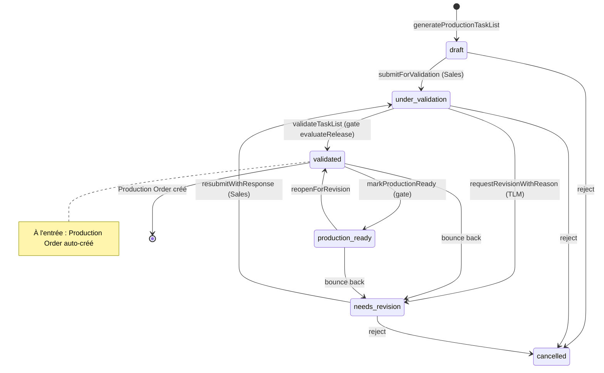
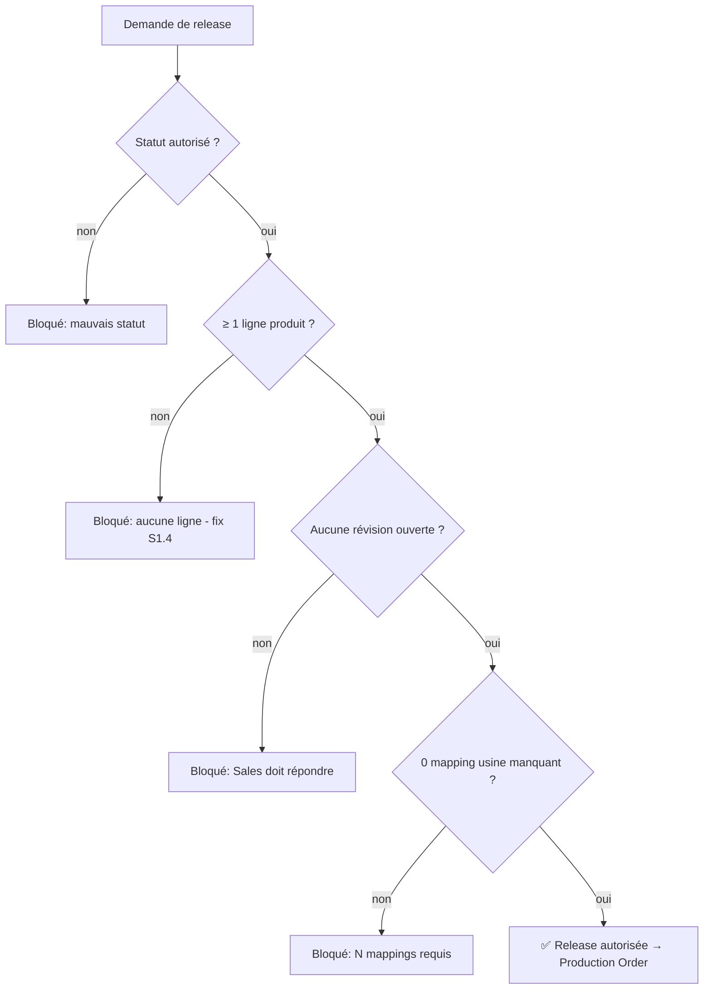

# Workflow — Validation & révision de Task List

> Le cœur de la collaboration **Sales ↔ Production** : soumettre, valider (ou renvoyer en révision), et « release » vers la production.

## 1. Diagramme Mermaid

**Le gate de release `evaluateRelease` (ordre des blocages) :**

## 2. Tableau des transitions

| De → Vers | Rôle | Action | Capability | Validations | Événement |
|---|---|---|---|---|---|
| draft → under_validation | Sales | `submitForValidation` | — | stampe `submitted_at` | `tl.submitted_for_validation` |
| under_validation → needs_revision | TLM/Ops | `requestRevisionWithReason` | `task_list.validate` | **catégorie + message requis** | `tl.needs_revision` |
| needs_revision → under_validation | Sales | `resubmitWithResponse` | — | **réponse requise** | `tl.submitted_for_validation` |
| under_validation → validated | TLM/Ops | `validateTaskList` | `task_list.validate` | **gate `evaluateRelease`** (4 conditions) | `tl.validated` |
| validated → production_ready | TLM/Ops | `markProductionReady` | `task_list.validate` | gate `evaluateRelease` | `tl.production_ready` |
| production_ready → validated | TLM/Ops | `reopenForRevision` | `task_list.validate` | — | `tl.validated` |
| → cancelled | TLM/Ops | `rejectTaskList` | `task_list.reject` | — | `tl.cancelled` |
| (validation) | (système) | `ensureProductionOrderForTaskList` | — | idempotent, 1 PO/task list | `po.created` |

## 3. Explication en français clair

Une task list naît en **brouillon** (`draft`), modifiable par le commercial. Quand elle est prête, il la **soumet pour validation** (`under_validation`) — à partir de là, **le commercial ne peut plus l'éditer** tant que la production ne la lui renvoie pas.

L'équipe **production** (Task List Manager ou Operations) l'examine. Deux issues :

- **Renvoi en révision** : elle demande une correction avec une **catégorie et un message obligatoires** (le motif est inscrit dans la conversation). La task list passe en `needs_revision` ; le commercial redevient éditeur, corrige, et **répond + re-soumet** (réponse obligatoire). La boucle peut se répéter.

- **Validation (« Release to Production »)** : autorisée **uniquement** si le **gate de release** est satisfait, dans cet ordre : (1) le statut le permet, (2) il y a **au moins une ligne produit** (on ne valide pas une task list vide), (3) **aucune révision n'est ouverte**, (4) **aucun mapping usine n'est manquant** (chaque option commerciale doit être traduite en instruction usine). La même fonction garde le serveur **et** désactive le bouton — l'écran et le serveur ne peuvent jamais diverger.

À la validation, un **ordre de production** est **créé automatiquement** (statut *awaiting_deposit*). La task list peut ensuite être marquée « production ready » (PDF usine disponible), ou renvoyée en révision si besoin.

## Changement de propriétaire
- **Aucun** : la validation est faite par un rôle technique, mais la task list reste rattachée à son affaire/propriétaire d'origine.

## Règles clés mobilisées
- Verrou Sales (`TASK_LIST_LOCKED_FOR_SALES`) hors draft/needs_revision.
- Gate `evaluateRelease` (4 conditions) — fix S1.4 (task list vide) inclus.
- Révision = motif obligatoire ; reply = réponse obligatoire (stockés dans `entity_messages`).
- Mappings usine résolus en couches (override > preset client > global > missing).
</content>
