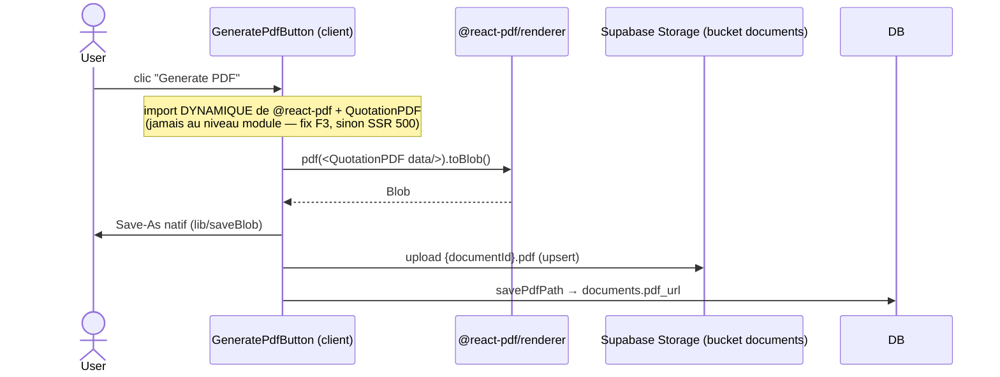

# Workflow technique — Jobs, automatisations, génération PDF & storage

## 1. Réponse directe : il n'y a AUCUN job d'arrière-plan

Vérifié **des deux côtés** :
- **Application** : aucun `setInterval`, `node-cron`, `@vercel/cron`, `EventSource`, ni `supabase.channel`/realtime dans `lib/` ou `app/`. Pas de `vercel.json` (donc pas de Vercel Cron).
- **Base de données** : aucun `pg_cron`, `cron.schedule`, `pg_net`/`net.http`, ni `LISTEN`/`NOTIFY` applicatif (seulement le `notify pgrst, 'reload schema'` standard en fin de migration).

**Conséquence métier** : compteurs, badges, alertes, rappels, « Today's Work », forecast, notifications — **tout est recalculé à chaque rendu de page serveur (SSR)** à partir de l'état courant. Si l'utilisateur ne se connecte pas, rien n'est « envoyé » ; l'information l'attend au prochain chargement.

## 2. Les seules « automatisations » réelles

| Automatisation | Type | Déclencheur |
|---|---|---|
| **Cascade d'annulation** (m023) | Trigger DB **synchrone** | UPDATE `documents.status` → cancelled/lost |
| **Snapshot produit** (m089) | Trigger DB **synchrone** | INSERT/UPDATE des lignes (gèle name/sku/category) |
| **Auto-advance dépôt** | Logique applicative | Enregistrement d'un dépôt ≥ seuil |
| **Auto-création du Production Order** | Logique applicative | Validation de la task list |
| **Auto-advance Service Request** | Logique applicative | Tous les enfants requis complétés |
| **Résolution BL** | Logique applicative | Profil BL devient complet |

> Toutes sont **synchrones** à une action utilisateur ou un UPDATE — **aucune** ne s'exécute « toute seule » dans le temps.

## 3. Envoi d'email / SMS / push : aucun
Il n'existe **aucun canal de notification externe**. Toute notification est **in-app**, calculée à la lecture. (Un futur ajout d'emails nécessiterait l'introduction d'un mécanisme d'arrière-plan, absent aujourd'hui.)

## 4. Génération PDF (workflow technique)

- **Fix F3** : `@react-pdf/renderer` et `QuotationPDF` sont importés **dynamiquement au clic** (browser-only) — un import au niveau module casse le rendu serveur (HTTP 500).
- Types de PDF : **QUOTATION** / **PROFORMA INVOICE** (`QuotationPDF`), **COMMERCIAL INVOICE** (`CommercialInvoicePDF`, CI-XXXX), **FACTORY** (`FactoryPDF`, task list).
- Nom de fichier canonique : `TYPE_NUMBER_CLIENT_AFFAIR[_Vn].pdf` (`lib/pdf-filename.ts`, pur + testé).
- Export à la demande : `GET /api/documents/[id]/pdf` → URL signée 5 min.

## 5. Storage (fichiers)
| Bucket | Contenu |
|---|---|
| `documents` | PDF générés + attachments (préfixe `attachments/<affair_id>/`) |
| `product-images` | Images produits |
- Téléchargements via **URLs signées court-lived** (5 min), pas d'accès public direct. RLS sur les tables de métadonnées (`attachments`, `order_documents`).

## 6. Middleware (la seule logique « inter-requête »)
`middleware.ts` rafraîchit la session Supabase et redirige les non-authentifiés vers `/login` (et les authentifiés hors de `/login`). C'est de la logique **par requête**, pas un job.
</content>
