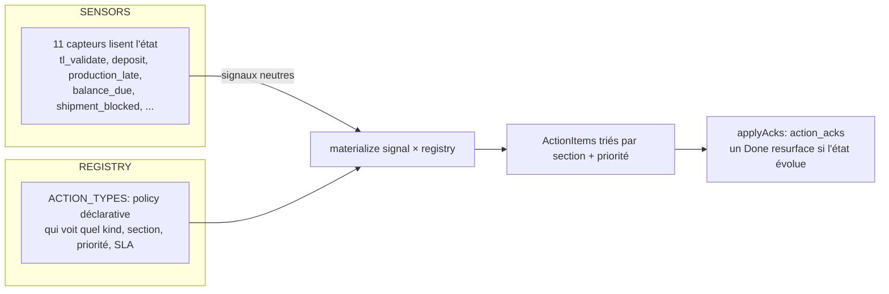

# Workflow technique — Dashboards, compteurs, badges & Action Center

> Comment toute la couche de synthèse est calculée à la lecture, à partir de l'état des entités.

## 1. Architecture de l'Action Center (`lib/action-center.ts`)

**Principe** : les **capteurs** émettent des signaux neutres `{kind, entity, owner, ageDays}` (changent quand le *modèle de données* change), le **registre** porte toute la policy (changent quand une *règle* change), et `materialize` applique la policy + les SLA d'escalade. 4 sections : urgent / waiting_me / waiting_client / info_missing.

## 2. Les 11 capteurs (signaux → actions à faire)
| Signal | Détecte |
|---|---|
| `tl_validate` | task list `under_validation` |
| `tl_clarify` | task list `needs_revision` |
| `doc_validate` | devis en attente de validation (m068) |
| `deposit` | order `awaiting_deposit` |
| `production_late` | retard usine / overdue |
| `balance_due` | solde non reçu après production |
| `shipment_blocked` | terminé mais non booké ≥ 7 j |
| `missing_deadline` | order sans deadline |
| `won_no_tasklist` | devis won sans task list |
| `bl_missing_destination` | incoterm vendeur + BL non rempli |
| `tender_stalled` | tender accepté sans next-action |

## 3. Dashboard SALES — 3 buckets (`lib/dashboard-items.ts`, pur/testable)
- **critical** : actions échues, reminders échus, affaire vivante **sans action ouverte**, **devis bloqué** (sent sans personne pour le pousser).
- **dueToday** : actions/reminders dus aujourd'hui.
- **preventive** : devis sans réponse au-delà de la fenêtre (`dashboard.preventive_days`, défaut 7), affaires endormies.
Seule la **dernière version** de chaque famille de devis décide.

## 4. Badges de navigation (`lib/nav-badges.ts`)
- **Orders** : nombre d'ordres en retard/overdue non terminaux.
- **Task Lists** : nombre en `under_validation`/`needs_revision`.
- **RLS-scopés, soft-fail → 0**, recalculés à chaque rendu.

## 5. Forecast & Business (compteurs financiers)
- **CA = devis gagnés uniquement** (`type=quotation AND status=won`) — la proforma est exclue partout.
- **Forecast pondéré** = `Σ total × probability/100` ; **commit** = somme de la catégorie « commit ». Perso (sales) vs global (`forecast.view_global`).

## 6. Caractéristique commune
Tous ces calculs sont :
- **RLS-scopés** (chacun ne voit que ses lignes),
- **soft-fail → 0** (une table manquante ne casse pas la page),
- **recalculés à chaque rendu serveur** (aucun cache, aucune matérialisation).

## Le sandbox operations-v2
Le prototype `/dashboard/operations-v2` ancre la vue d'exécution sur les **proformas** (la commande) et range les signaux via un *rulebook* en data (`lib/dashboard-operations-config.ts`, placement today/flight/both/off). C'est une **sandbox** destinée à remplacer le contenu du toggle Operations.
</content>
