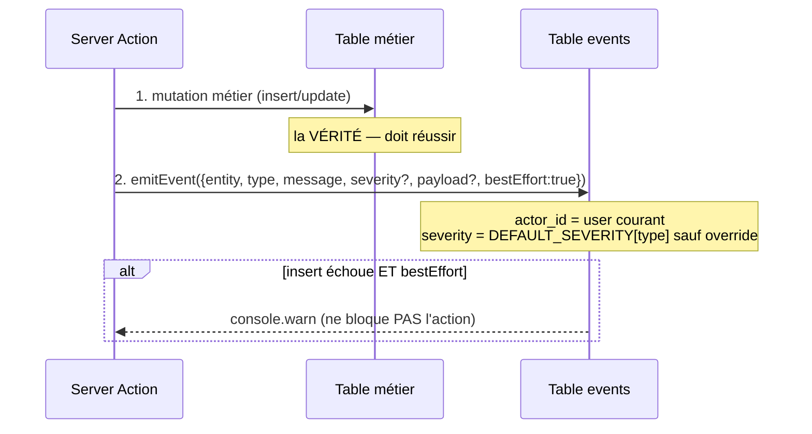

# Workflow technique — Émission d'événements & Audit trail

> Comment l'application crée et lit sa trace d'audit immuable.

## 1. Émission (`emitEvent`)

**Règles techniques** :
- `emitEvent` est appelé **après** la mutation métier, en **best-effort** (`bestEffort: true`) : une panne du journal ne bloque jamais l'action.
- Sévérité par défaut = `DEFAULT_SEVERITY[event_type]` (`lib/events.ts`), surchargeable.
- **Immuabilité** : RLS autorise `INSERT` mais jamais `UPDATE`/`DELETE` de la ligne.
- **Anti-spam** : `emitEventOnce(... dedupKey, windowMinutes)` saute les doublons récents (même type + entité + dedup_key) ; émet quand même si le lookup échoue (jamais de perte d'un vrai event).
- **Émission typée** : `emitNotificationEvent(eventKey, {entityId})` dérive `entity_type` + message du catalogue.

## 2. Le seul « automatisme » DB : les cascades d'annulation

Le **seul** émetteur d'événements non déclenché par une action utilisateur est le **trigger** `propagate_document_cancellation` (m023) : quand un document passe `cancelled`/`lost`, il annule en cascade les task lists + orders liés et émet `tl.cancelled` / `po.cancelled`. C'est **synchrone** à l'UPDATE (pas un job).

## 3. Lecture (consommateurs)

| Fonction | Usage |
|---|---|
| `listEventsForEntity` | Timeline d'une entité |
| `listEventsForEntities` | Timeline agrégée (client, affaire) |
| `listOperationsFeed` | Cockpit Operations (non résolus + résolus < 24 h) |
| `listRecentCriticalEvents` | Widget « événements critiques récents » |
| `listEventComments` | Fil de discussion d'un event |

## 4. État lu / non-lu (m045)

- `event_reads` stocke `last_read_at` par (user, event).
- **Non-lu** = `comment.created_at > last_read_at` ET auteur ≠ utilisateur courant — **calculé à la lecture** (`getUnreadCommentCountsForUser`, `getEventLastReadMap`).
- Marqué lu en **ouvrant** l'item (lien `?event=<id>` qui overlay le drawer).

## 5. Workflow collaboratif (ticket)

Un event peut être pris en charge comme un ticket (m039/m044) : `status` (open → acknowledged → working → waiting → escalated → resolved), `waiting_for`, `owner_id`. Ces champs **sont** modifiables (contrairement au reste de la ligne) via des chemins dédiés.

## Logs applicatifs
Les erreurs (échec d'`emitEvent`, requêtes RLS qui échouent) sont **journalisées via `console.error`/`console.warn`** côté serveur. Il n'y a pas de table de logs applicatifs ni d'agrégateur dédié — le journal `events` est l'audit **métier**, distinct des logs techniques.
</content>
