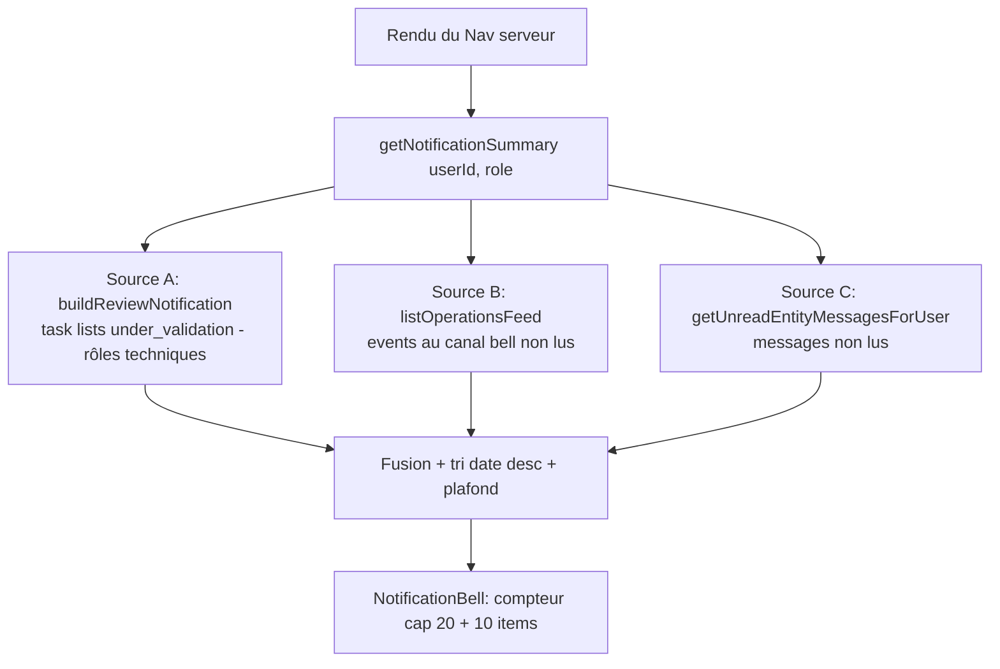

# Workflow technique — Calcul des notifications (cloche)

> Comment la cloche est calculée à chaque rendu, sans table de notifications ni envoi.

## 1. Pipeline de calcul (`getNotificationSummary`)



## 2. Résolution du canal (bell / feed / off)

```
canal = notification_rules[role][event_key]   (override admin m123)
        ?? defaultChannel(event_key, severity)  (legacy)
```
- `defaultChannel` = `eventRaisesBell` : critical/high → bell ; medium → bell si dans l'allowlist actionnable, sinon feed ; low → feed.
- **Table `notification_rules` vide ⇒ comportement legacy exact** (sécurité de migration).

## 3. Détermination du non-lu
- **Commentaire non lu** : `event_comments.created_at > event_reads.last_read_at` (auteur ≠ moi).
- **Création non lue (Decision D)** : event high/critical/actionable-medium dont la création est postérieure au dernier `last_read_at`.
- **Message non lu** : `entity_messages` plus récent que `entity_message_reads`.

## 4. Ce qu'il n'y a PAS
- ❌ Pas de table `notifications` (rien n'est matérialisé).
- ❌ Pas d'email / SMS / push.
- ❌ Pas de polling client (le composant reçoit un **snapshot serveur** au rendu).
- ❌ Pas de cron qui « envoie » des notifications.

## 5. Le modèle « broadcast par visibilité »
Il n'y a **pas de champ destinataire**. Un utilisateur voit une notification s'il **peut voir l'event par RLS** ET que le canal résolu = bell. Pour les workflows multi-rôles (Service Requests), c'est la **RLS des events** (branche `project_request` m092) qui garantit que le bon rôle reçoit le bon relais.

## 6. Les rappels (reminders) — même logique
- `quotation_reminders` (m043) : rappels **manuels** (date + note). Classés `due/overdue/upcoming` **à la lecture** (`lib/reminders.ts`) ; remontent dans les buckets du dashboard. **Aucun déclenchement automatique** — un rappel est juste lu et classé au prochain rendu.
- `balance_reminder_days_before_eta` (m048) : alimente les pills de paiement, dérivé au render.

## Détail
Voir [../09-Notifications.md](../09-Notifications.md) pour le tableau « qui reçoit quoi, quand ».
</content>
