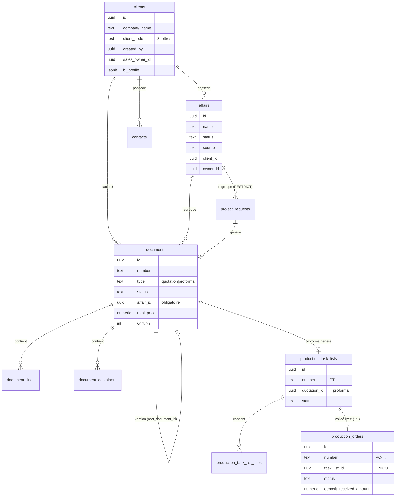
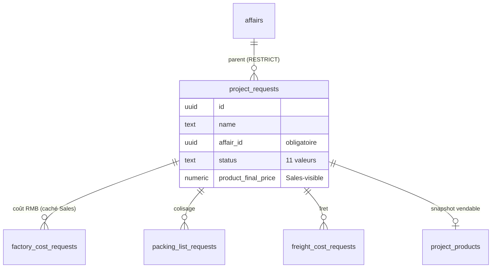
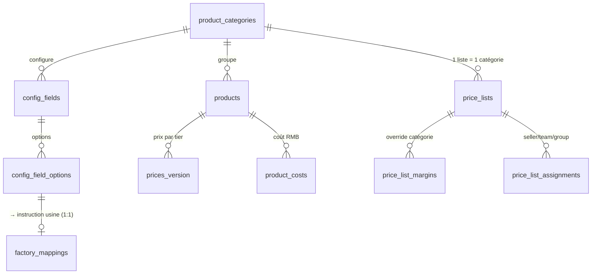
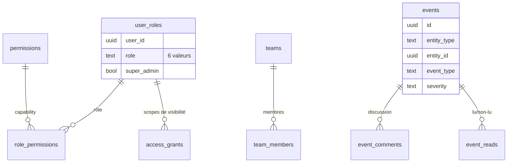

# Carte — Modèle de données (ERD)

> Relations principales entre les tables métier. Simplifié (colonnes clés seulement). Source : `lib/types.ts` + migrations.

## 1. Cœur commercial → production

## 2. Service Requests & enfants

## 3. Catalogue & pricing

## 4. Gouvernance & audit

## Notes
- `documents` n'a **pas** de `created_at` (utiliser `date`) ni `total` (utiliser `total_price`).
- `production_task_lists.quotation_id` pointe sur la **proforma**, pas le devis.
- `production_orders` est 1:1 avec une task list validée.
- `events` est polymorphe (`entity_type` + `entity_id`), sans FK stricte vers les entités.
- Le client Supabase est **non typé** : une faute de colonne échoue au **runtime** (42703), pas à la compilation.
</content>
