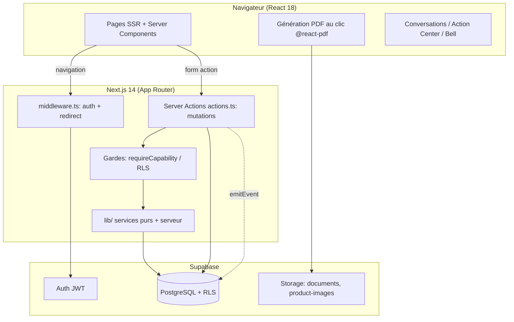
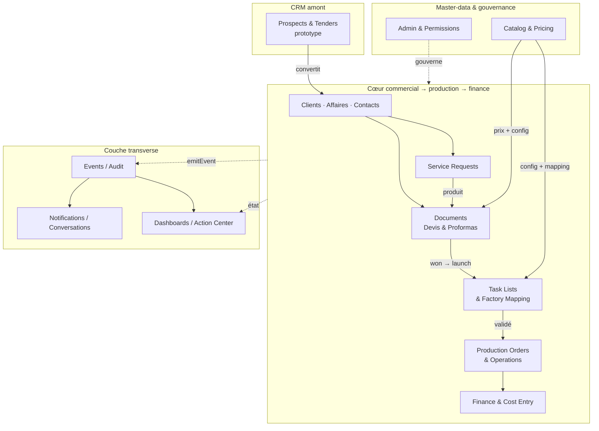

# Carte — Architecture fonctionnelle

## 1. Couches techniques

## 2. Architecture fonctionnelle (modules métier)

## 3. Lecture
- Le **cœur** (Clients → Documents → Task Lists → Production → Finance) est la chaîne validée end-to-end.
- Le **CRM amont** (Prospects/Tenders) est un prototype qui alimente le cœur.
- Les **master-data** (Catalog/Pricing) nourrissent les devis et la production ; **Admin/Permissions** gouverne tout.
- La **couche transverse** (Events → Notifications/Dashboards) est **dérivée** : tout y est recalculé à la lecture, sans job d'arrière-plan.
</content>
