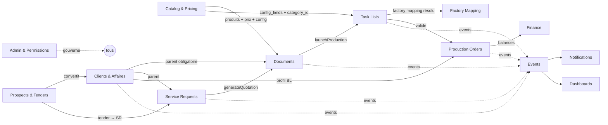
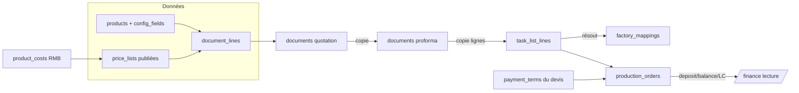

# Carte — Dépendances modules & flux de données

## 1. Dépendances entre modules

## 2. Flux de données — du devis à l'encaissement

## 3. Dépendances de la couche `lib/`

| Module | Dépend de (`lib/`) |
|---|---|
| Documents | `payment`, `pdf-filename`, `validation`, `pricing`, `price-lists` |
| Task Lists | `task-list-mapping-status`, `task-list-mapping-server`, `types` (resolveFactoryInstruction), `factory-mapping-clone` |
| Production | `production-lifecycle`, `delays`, `working-days`, `bl`, `shipping`, `shipping-docs`, `operations-alerts`, `payment` |
| Service Requests | `project-pricing`, `project-dashboard`, `project-queue`, `service-types`, `freight-validity` |
| Clients/Affaires | `client-affairs`, `affairs-prototype`, `owner`, `visibility` |
| Prospects | `tender-identity`, `attribution-parse`, `prospect-intel`, `tender-discovery` |
| Pricing | `pricing-engine`, `pricing`, `price-lists`, `pricing-settings` |
| Transverse | `events`, `events-shared`, `notifications`, `notification-catalog`, `action-center`, `dashboard-items`, `reminders`, `entity-messages`, `forecast` |
| Sécurité | `auth`, `permissions`, `visibility`, `types` |

## 4. Couplages clés à connaître
- **`lib/types.ts`** est le socle partagé (statuts, helpers de rôle, `resolveFactoryInstruction`, calculs de paiement) — importé presque partout.
- **`lib/events.ts`** (serveur) re-exporte **`lib/events-shared.ts`** (pur) pour que les composants client puissent importer les types sans tirer `next/headers`.
- Le **cœur figé** (commit `157e52c`) importe des symboles d'autres lots non commités (ex. `canSupervise` de `lib/types`) — il ne build pas en isolation (voir HANDOVER).
</content>
