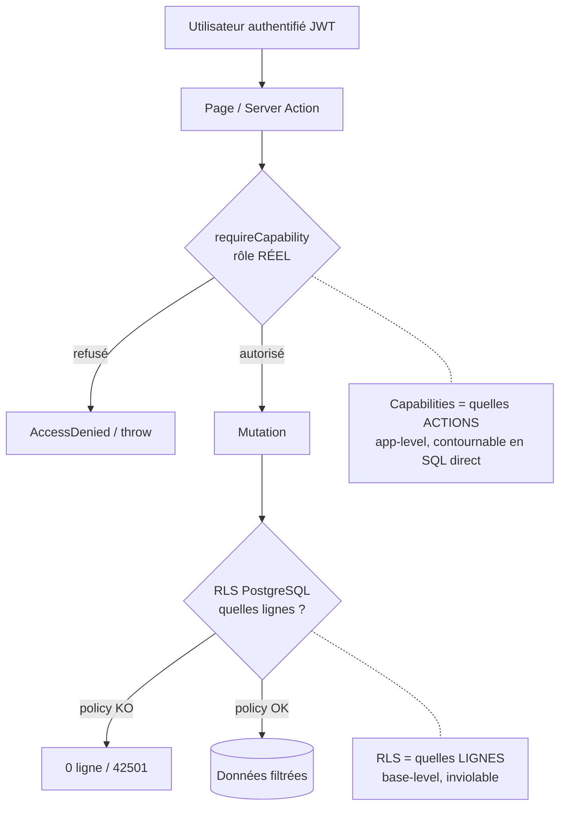
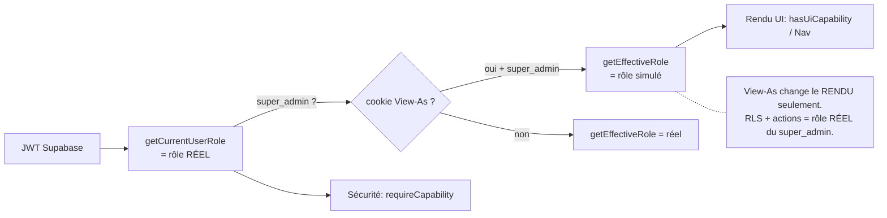
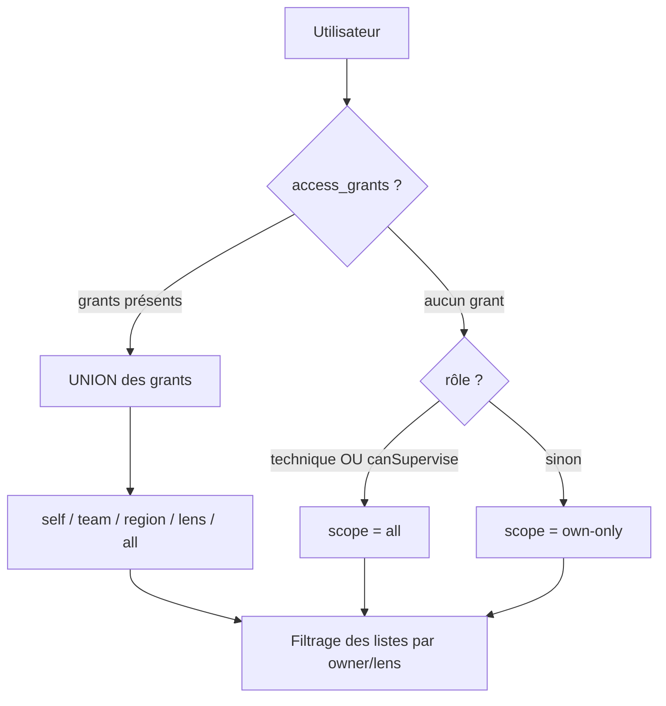

# Carte — Sécurité & Visibilité

## 1. Les deux couches de sécurité

## 2. Résolution du rôle (réel vs effectif)

## 3. Moteur de visibilité (`getVisibilityScope`)

## 4. Matrice synthétique des accès aux routes

| Route | sales | dir | tlm | ops | finance | admin | super |
|---|:-:|:-:|:-:|:-:|:-:|:-:|:-:|
| Dashboard, Clients, Projects, Task Lists, Orders | ✅ | ✅ | ✅ | ✅ | ✅ | ✅ | ✅ |
| Prospects | ✅ | ✅ | ❌ | ❌ | ❌ | ✅ | ✅ |
| Finance | ❌ | ✅ | ❌ | ❌ | ✅ | ✅ | ✅ |
| Cost Entry | ❌ | ❌ | ❌ | ❌ | ✅ | ✅ | ✅ |
| Admin master-data | ❌ | ❌ | ❌ | ❌ | ❌ | ✅ | ✅ |
| Users / Permissions / Diagnostics | ❌ | ❌ | ❌ | ❌ | ❌ | ❌ | ✅ |

> ✅ = page atteignable (la donnée reste filtrée par RLS). Détail + RLS par table : [../07-Roles-and-Permissions.md](../07-Roles-and-Permissions.md).

## 5. Points de vigilance sécurité (rappel)
- **View-As invalide les conclusions** de sécurité/visibilité (RLS = JWT admin) — tester avec de vrais logins.
- La **matrice live peut diverger du seed** (priv-esc TLM résolu 2026-06-20) — recouper avec la base.
- Certaines gardes métier sont **applicatives** (proforma-not-won, H1/H2) — un UPDATE SQL direct les contournerait ; les **cascades** restent garanties par trigger.
- **Matrice vs RLS** parfois non alignées (capabilities déléguées mais RLS plus strictes).
</content>
