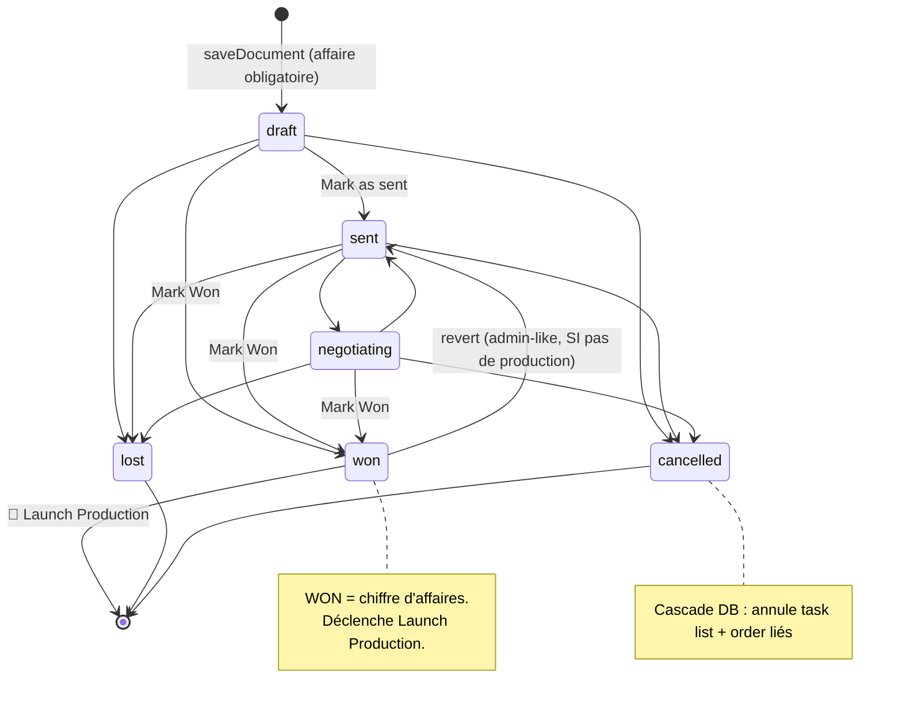
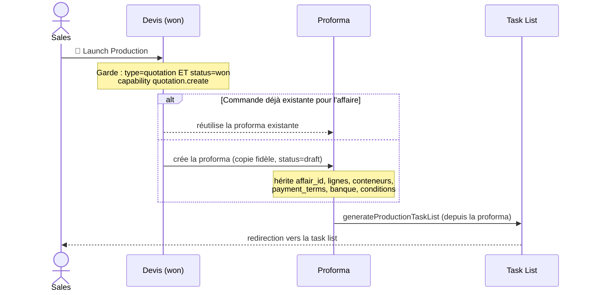
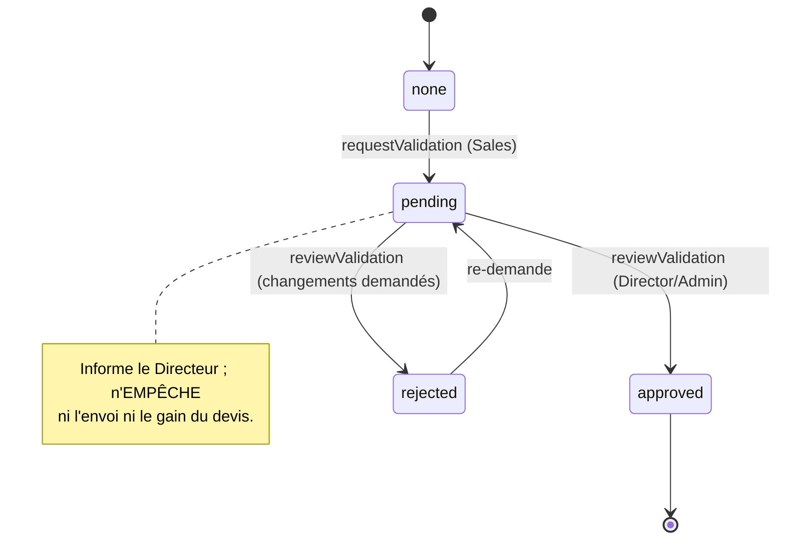
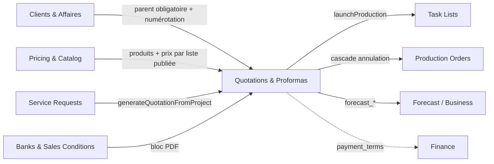

# PRD-005 — Quotations & Proformas (Devis & Commandes)

| | |
|---|---|
| **Domaine** | Documents commerciaux — Devis (Quotation) & Proforma (Commande) |
| **Statut** | `Baseline` — décrit l'existant (working tree, branche `freeze/core-metier`) |
| **Version** | 1.0 — 2026-06-29 |
| **Audience** | Dirigeants · Équipes commerciales · Spécialistes IA · Développeurs · Nouveaux collaborateurs |
| **Tables** | `documents`, `document_lines`, `document_containers` |
| **Routes** | `/documents/new`, `/documents/[id]`, `GET /api/documents/[id]/pdf` |
| **Docs liés** | [Blueprint — Module](../blueprint/02-Modules/documents-quotations-proformas.md) · [Objet Quotation](../blueprint/03-Business-Objects/quotation.md) · [Objet Proforma](../blueprint/03-Business-Objects/proforma.md) · [Workflow devis](../blueprint/04-Business-Workflows/quotation-lifecycle.md) · [Launch Production](../blueprint/04-Business-Workflows/launch-production.md) |

> **Convention de fiabilité** : **[V]** vérifié dans le code · **[P]** probable (déduit, non testé E2E) · **UNKNOWN** non déterminable · **TO BE VALIDATED** règle implicite à confirmer.
> **Principe** : ce PRD **décrit fidèlement l'existant**. Toute proposition d'évolution est isolée dans les sections **Automatisation**, **IA** et **Future Improvements**.

---

## 1. Vision & objectif métier

Le module **Quotations & Proformas** est le **moteur commercial** de Solux : il transforme une opportunité en **offre chiffrée** envoyée au client (le *Devis*), puis, une fois l'affaire gagnée, en **commande de production** (la *Proforma*).

C'est le **point de bascule** entre le monde commercial (négociation, prix, marges) et le monde opérationnel (production, expédition, encaissement). Deux objets, **une seule table** (`documents`), distingués par un champ `type` :

- **Quotation (Devis)** — le document de négociation. **C'est la seule source du chiffre d'affaires** : un devis `won` = du CA.
- **Proforma (Commande)** — une **copie fidèle** d'un devis gagné, qui pilote la production. Son en-tête PDF lit « PROFORMA INVOICE ». Elle est volontairement neutre côté revenu (jamais comptée comme un second deal).

**Objectif** : permettre à un commercial de produire un devis juste (bon client, bonne affaire, bons prix, bonnes conditions de paiement), de le faire évoluer proprement (versions), et de déclencher la production **en un clic** sans jamais manipuler les mécaniques internes.

---

## 2. Le problème que le module résout

| Problème métier | Réponse du module |
|---|---|
| Produire des offres cohérentes et numérotées par client | Numérotation automatique `SLX-{code client}-{année}-{séquence}` ; prix issus des listes de prix publiées |
| Négocier sans perdre l'historique | **Versioning** : un devis envoyé n'est jamais écrasé ; toute modification crée une V2/V3 traçable |
| Éviter le double comptage du chiffre d'affaires | La proforma (commande) est créée en `draft` et **ne peut jamais être `won`** → le CA reste le devis gagné |
| Passer du commercial à la production sans friction ni erreur de recopie | **Launch Production** : un clic copie fidèlement le devis en proforma + génère la task list |
| Garantir l'intégrité quand on annule | **Cascade d'annulation** (déclencheur base de données) : annuler le devis annule automatiquement la task list et l'ordre liés |
| Tracer qui a fait quoi | Chaque transition émet un **événement** immuable (audit trail) |

---

## 3. Utilisateurs concernés

| Rôle | Usage du module |
|---|---|
| **Sales (Commercial)** | Acteur principal : crée, édite, envoie, négocie ses devis ; les marque gagnés ; lance la production. Voit **uniquement ses propres** documents (RLS). |
| **Sales Director (Directeur commercial)** | Supervise : **approuve/refuse** les demandes de validation de devis ; **réassigne** le propriétaire d'un deal. Voit toute la donnée commerciale. |
| **Task List Manager** | Peut aussi créer/annuler des devis (chevauchement opérationnel). |
| **Admin / Super Admin** | Tous droits, dont archivage et suppression (super_admin pour la suppression physique). |
| **Finance** | Lecture des montants attendus (dépôt/solde) en aval, via `/finance` (hors de ce module mais dépendant de `payment_terms`). |

> Personas : *« Sam Sales »* construit 5 devis/jour et veut éviter de ressaisir ; *« Dana Director »* veut un garde-fou avant l'envoi de gros devis ; *« la direction »* veut un CA fiable (jamais gonflé par les proformas).

---

## 4. Workflows métier

### 4.1 — Cycle de vie du Devis

### 4.2 — Launch Production (Devis gagné → Proforma + Task List)

### 4.3 — Boucle de validation *advisory* (facultative, ne bloque jamais)

### 4.4 — Tableau récapitulatif des transitions

| De → Vers | Rôle | Action serveur | Capability | Conditions / validations | Événement |
|---|---|---|---|---|---|
| (création) → draft | Sales | `saveDocument` | `quotation.create` | **affaire obligatoire** ; payment_terms valides ; client_code requis | `doc.created` |
| draft → sent | Sales | `updateDocumentStatus` | — | — | `doc.status_changed` |
| sent ↔ negotiating | Sales | `updateDocumentStatus` | — | — | `doc.status_changed` |
| → won | Sales | `updateDocumentStatus` | — | **proforma interdite** | `doc.won` |
| → lost | Sales | `updateDocumentStatus` | — | cascade DB | `doc.lost` |
| → cancelled | Sales | `cancelQuotation` | `quotation.cancel` | cascade DB (task lists + orders) | `doc.cancelled` |
| won → éditable (revert) | Admin-like | `updateDocumentStatus` | — | **bloqué si production existe** (H1) | `doc.status_changed` |
| Launch Production | Sales | `launchProduction` | `quotation.create` | source `type=quotation` ET `status=won` | `doc.created` (proforma) |
| Réassigner owner | Director/Admin | `assignDocumentOwner` | `canSupervise` | change `sales_owner_id` (→ TL/PO) | — |
| Archiver | Admin | `archiveQuotation` | `quotation.archive` | soft-delete | `doc.status_changed` |
| Supprimer | Admin/Super | `deleteQuotation` | `quotation.delete` | **verrouillé si task list/PO** (m078) | `doc.deleted` |
| Demander validation | Sales | `requestValidation` | — | advisory | `doc.validation_requested` |
| Approuver/Refuser | Director/Admin | `reviewValidation` | `canSupervise` | advisory (ne bloque pas) | `doc.validation_approved/rejected` |

---

## 5. Règles métier

| # | Règle | Lieu d'application | Fiab. |
|---|---|---|---|
| D1 | Un **devis envoyé n'est jamais édité en place** → toute modification crée une **nouvelle version** (V2/V3). | application | [V] |
| D2 | L'**édition-en-place est réservée aux `draft`** ; sur un autre statut → « créer une nouvelle version ». | application | [V] |
| D3 | Le **numéro de document est immuable** (number/status/created_by préservés à l'édition). | application | [V] |
| D4 | Un **devis/proforma doit être rattaché à une affaire** (`affair_id`), sauf révision/edit qui héritent. | application (`saveDocument`) | [V] |
| D5 | La **numérotation exige un code client de 3 lettres** (sinon exception du RPC). | application + RPC | [V] |
| D6 | Une **proforma ne peut JAMAIS être `won`** (« la proforma est la commande, pas un deal gagné »). | application | [V] |
| D7 | Un **devis `won` ne redevient pas éditable** s'il a une production ; sinon réservé aux admin-like (garde H1). | application | [V] |
| D8 | Un **devis annulé/perdu ne se rouvre pas** s'il a des enfants annulés → créer une version (garde H2). | application | [V] |
| D9 | Un **devis avec task list ou ordre de production ne peut pas être supprimé** (Decision F / m078). | application + RLS | [V] |
| D10 | L'**annulation cascade** (déclencheur DB m023) : annule task lists + orders liés. **Inviolable** même en SQL direct. | trigger DB | [V] |
| D11 | Les **conditions de paiement** sont validées à la sauvegarde (acompte 0–100, mode LC cohérent, etc.). | application (`lib/payment.ts`) | [V] |
| D12 | Le **CA = devis gagnés uniquement** (`type=quotation AND status=won`) ; la proforma est exclue partout. | application | [V] |
| D13 | La **proforma est créée en `draft`** par Launch Production (anti-double-comptage du CA). | application | [V] |
| D14 | **Une seule commande (proforma) par affaire** : Launch Production réutilise une proforma existante. | application | [V] |

> ⚠️ **Important (modèle de sécurité)** : les règles D6, D7, D8 sont **applicatives** (server action), non RLS — un `UPDATE` SQL direct par un administrateur les contournerait. La cascade D10 reste, elle, garantie par déclencheur. Voir [Future Improvements](#14-future-improvements).

---

## 6. Permissions par rôle

| Capability | Sales | Sales Dir | TLM | Operations | Finance | Admin | Super | Source |
|---|:-:|:-:|:-:|:-:|:-:|:-:|:-:|---|
| `quotation.create` | ✅ | TBV | ✅ | ✅ | — | ✅ | ✅ | m026 |
| `quotation.cancel` | ✅ | — | ✅ | ✅ | — | ✅ | ✅ | m026 |
| `quotation.archive` | ❌ | — | ❌ | ❌ | — | ✅ | ✅ | m026 |
| `quotation.delete` | ✅¹ | — | ❌ | ❌ | — | ✅¹ | ✅ | m026 + m055 |
| Réassigner l'owner (`assignDocumentOwner`) | ❌ | ✅ | ❌ | ❌ | ❌ | ✅ | ✅ | `canSupervise` |
| Approuver une validation (`reviewValidation`) | ❌ | ✅ | ❌ | ❌ | ❌ | ✅ | ✅ | `canSupervise` |
| Lancer la production (`launchProduction`) | ✅ | TBV | ✅ | ✅ | — | ✅ | ✅ | `quotation.create` |

¹ `quotation.delete` : m026 met `admin`/`sales` à `false` ; **m055** les passe à `true`. État effectif = celui de la dernière migration appliquée. **La suppression reste bloquée** s'il existe une task list/ordre (D9).

**Visibilité (RLS) des documents** : `documents read scoped` (m046) = `created_by` OU rôle technique (admin/tlm/operations/super) ; **+ finance** (lecture, m119) ; **+ sales_director** (org-wide, m132). La **suppression** est resserrée par statut (m078 : le propriétaire ne supprime que draft/sent/negotiating ; admin/super tout statut). Un document non visible renvoie `404` (`notFound()`).

---

## 7. Événements importants

Tous via `emitEvent` (best-effort, après la mutation). Catalogue complet : [Blueprint — Events](../blueprint/08-Events.md).

| Événement | Sévérité | Canal par défaut | Déclencheur |
|---|---|---|---|
| `doc.created` | low | feed | Création d'un devis / proforma |
| `doc.updated` | low | feed | Édition en place d'un draft |
| `doc.status_changed` | low | feed | draft→sent, negotiating, archive |
| `doc.won` | medium | feed | Devis marqué gagné |
| `doc.lost` | low | feed | Devis perdu |
| `doc.cancelled` | **critical** | **bell** | Devis annulé (cascade) |
| `doc.deleted` | **critical** | **bell** | Suppression physique |
| `doc.validation_requested` | high | **bell** | Sales demande une validation |
| `doc.validation_approved` | medium | **bell** | Director approuve |
| `doc.validation_rejected` | high | **bell** | Director demande des changements |

---

## 8. Notifications

> Rappel système : **pas de table de notifications, pas d'email, pas de cron** — tout est calculé à la lecture (SSR). Voir [Blueprint — Notifications](../blueprint/09-Notifications.md).

| Notification | Qui la reçoit | Quand |
|---|---|---|
| Demande de validation de devis (`doc.validation_requested`) | **Sales Director / Admin** (`canSupervise`) | Le commercial clique « Request validation » |
| Réponse de validation (`doc.validation_approved/rejected`) | **Sales demandeur** | Le directeur tranche |
| Devis annulé / supprimé | Tous ceux qui voient l'entité (RLS) | À l'annulation/suppression |
| Commentaire / note sur le devis | Les autres participants RLS-autorisés | Un message est posté sur la conversation du document |

Le déclenchement de la cloche dépend de la **sévérité** + des **règles par rôle** (`notification_rules`, m123, table vide ⇒ comportement par défaut ci-dessus).

---

## 9. Cas particuliers & cas d'erreur

| Situation | Comportement actuel | Fiab. |
|---|---|---|
| Devis sans **affaire** | Sauvegarde **refusée** (« ce document doit être rattaché à une affaire ») | [V] |
| Client **sans code 3 lettres** | Numérotation **échoue** (exception du RPC) | [V] |
| Tenter d'**éditer en place** un devis `sent`/`won` | Refusé → « créer une nouvelle version » | [V] |
| Tenter de marquer une **proforma `won`** | Refusé (garde serveur) | [V] |
| **Revert** d'un `won` qui a déjà une production | Bloqué (H1) ; sinon admin-like uniquement | [V] |
| **Rouvrir** un devis annulé/perdu avec enfants annulés | Bloqué (H2) → créer une version | [V] |
| **Supprimer** un devis avec task list/ordre | Bloqué (D9 / m078) | [V] |
| **Launch Production** alors qu'une proforma existe déjà | Réutilise la proforma existante (idempotent) | [V] |
| **Conditions de paiement** invalides | `throw` à la sauvegarde | [V] |
| Document **non visible** (RLS) | `404` (`notFound()`) | [V] |
| **PDF** : import statique d'une lib browser-only en SSR | A causé des **HTTP 500** (bug F3) → corrigé par import **dynamique au clic** ; ne jamais ré-importer au niveau module | [V] |
| Annuler un devis | **Cascade** : task list + ordre liés annulés (events critiques émis par le déclencheur) | [V] |
| Faute de **nom de colonne** (client Supabase non typé) | Échoue au **runtime** (42703), pas à la compilation ; ⚠️ `documents` n'a pas de `created_at` (utiliser `date`) | [V] |

---

## 10. KPI du module

> KPI **mesurables sur les données existantes** (aucune instrumentation supplémentaire requise).

| KPI | Définition | Source |
|---|---|---|
| **Chiffre d'affaires (CA)** | Σ `total_price` des devis `type=quotation AND status=won` | `documents` |
| **Taux de conversion (win rate)** | devis won ÷ total devis (proformas exclues) | `documents` |
| **Valeur moyenne d'un devis gagné** | CA ÷ nb devis won | `documents` |
| **Cycle de vente** | délai moyen `date` (draft) → passage `won` | `documents` + `events` |
| **Friction de négociation** | nb moyen de versions par affaire (`root_document_id`) | `documents` |
| **Devis bloqués** | devis `sent` actifs sans prochaine action ouverte sur l'affaire | dérivé (dashboard) |
| **Pipeline pondéré** | Σ `total_price × forecast_probability/100` (devis actifs) | `documents` (m050) |
| **Taux de recours à la validation** | devis avec `validation_status` non nul ÷ total | `documents` (m068) |
| **Délai de réponse** | `date` (sent) → 1er `doc.status_changed` suivant | `events` |

---

## 11. Dépendances avec les autres modules

| Module | Nature de la dépendance |
|---|---|
| **Clients & Affaires** | Affaire = parent **obligatoire** ; `client_code` pilote la numérotation ; `+ New Project` inline depuis le builder |
| **Pricing & Catalog** | Lignes = produits du catalogue ; prix = liste publiée assignée au vendeur (sinon fallback) ; config produit |
| **Service Requests** | `generateQuotationFromProject` produit un devis (via `saveDocument`) |
| **Task Lists** | Générée **depuis la proforma** par Launch Production ; hérite `affair_id` |
| **Production Orders** | Créé en aval ; **cascade d'annulation** ; affiché read-only sur le document |
| **Finance** | `payment_terms` alimente dépôt/solde/LC attendus |
| **Forecast / Business** | Champs `forecast_*` sur le document ; CA = devis won |
| **Banks & Sales Conditions** | Imprimés sur les PDF (banque selon devise, conditions numérotées) |

---

## 12. Opportunités d'automatisation *(propositions — hors existant)*

> Aujourd'hui, **aucune automatisation temporelle n'existe** (pas de cron/email). Pistes :

1. **Relances automatiques** sur les devis `sent` sans réponse au-delà d'un seuil (aujourd'hui : rappels **manuels**, classés à la lecture).
2. **Génération + archivage automatiques du PDF** au passage `sent` (aujourd'hui : clic manuel).
3. **Envoi du devis au client par email** avec lien de suivi (aujourd'hui : aucun canal externe).
4. **Auto-archivage** des devis `lost`/`cancelled` anciens pour désencombrer les vues.
5. **Pré-remplissage** d'un nouveau devis à partir du dernier devis gagné du même client (gabarit).
6. **Alerte proactive** « devis bloqué » poussée au directeur (aujourd'hui : visible seulement au dashboard du commercial).

---

## 13. Opportunités d'utilisation de l'IA *(propositions — hors existant)*

1. **Rédaction assistée de l'offre** : convertir `original_sales_request` (besoin client en texte libre) en lignes structurées suggérées (produit + config), que le commercial valide.
2. **Scoring de probabilité de gain** : prédire `forecast_probability` à partir de l'historique (client, montant, délai, nb de versions) pour fiabiliser le pipeline.
3. **Recommandation de prix/marge** : suggérer le tier de prix optimal selon l'historique d'achat du client et l'élasticité observée.
4. **Résumé de négociation** : synthétiser automatiquement l'écart entre versions (V1→V3) pour préparer un point client.
5. **Détection d'anomalies** : signaler un devis dont la marge, le délai de paiement ou l'incoterm s'écartent des normes du client/catégorie.
6. **Assistant conversationnel** sur l'historique d'une affaire (« montre-moi tous les devis perdus de ce client et pourquoi »).

> Toutes ces pistes s'appuieraient sur les modèles Claude (Opus/Sonnet/Haiku) en mode assistant — **avec validation humaine**, sans auto-conversion silencieuse (cohérent avec la vision « validation humaine progressive » de l'owner).

---

## 14. Future Improvements *(propositions — ne modifient pas l'existant)*

| # | Amélioration | Bénéfice | Effort estimé |
|---|---|---|---|
| FI-1 | **Clarifier `quotation.delete`** : trancher le conflit m026 (admin=false) vs m055 (admin=true) et documenter la valeur cible | Lever une ambiguïté de sécurité | Faible |
| FI-2 | **Durcir les gardes en RLS** : porter D6/D7/D8 (proforma-not-won, H1, H2) au niveau base, en défense en profondeur | Inviolabilité même en SQL direct | Moyen |
| FI-3 | **Validation bloquante optionnelle** : permettre (par catégorie/montant) une validation qui **empêche** l'envoi, en plus de l'advisory actuelle | Contrôle des gros devis | Moyen |
| FI-4 | **Canal client externe** (email/portail) pour l'envoi et le suivi des devis | Boucle client fermée | Élevé |
| FI-5 | **Types Supabase générés** (`gen:types`) adoptés progressivement | Tuer la classe d'erreurs 42703 (runtime → compile) | Moyen |
| FI-6 | **Notification « devis bloqué » au directeur** (pas seulement au commercial) | Pilotage commercial | Faible |

---

## 15. Open Questions

| # | Question | Pourquoi c'est ouvert |
|---|---|---|
| OQ-1 | `quotation.create` (et donc `launchProduction`) est-il accordé à **`sales_director`** dans la matrice **live** ? | Aucune migration dédiée trouvée ; dépend de l'état réel de `role_permissions` |
| OQ-2 | Pour `quotation.delete`, est-ce **m026** (admin=false) ou **m055** (admin=true) qui est appliqué en prod ? | Conflit de seed ; à lire sur la base |
| OQ-3 | Quels sont les **destinataires exacts** par événement (`notification_rules`) ? | Configurable en base, pas codé en dur |
| OQ-4 | Le **calcul du dépôt/solde attendu** à partir de `payment_terms` relève-t-il du périmètre Quotation ou Finance/Production ? | Logique partagée ; frontière de responsabilité à clarifier |
| OQ-5 | Faut-il **conserver** le champ `original_sales_request` comme simple rappel, ou l'exploiter activement (IA §13.1) ? | Décision produit (vision « pas d'auto-conversion ») |

---

## Annexe — Glossaire express

| Terme | Définition |
|---|---|
| **Devis / Quotation** | Offre commerciale chiffrée ; `documents.type='quotation'` ; seule source du CA |
| **Proforma / Commande** | Copie d'un devis gagné qui pilote la production ; `documents.type='proforma'` ; jamais du CA |
| **Version (V2/V3)** | Itération d'un devis dans la même affaire (`root_document_id` + `version`) |
| **Launch Production** | Action « un clic » : devis gagné → proforma + task list |
| **Validation advisory** | Demande d'avis facultative au directeur (ne bloque pas l'envoi) |
| **Cascade d'annulation** | Déclencheur DB qui annule task list + ordre quand le devis est annulé |

---

*Fin du PRD-005. — Document de référence, conforme au code au 2026-06-29 (branche `freeze/core-metier`). Les sections 12–14 sont prospectives et n'engagent aucune modification de l'existant.*
</content>
